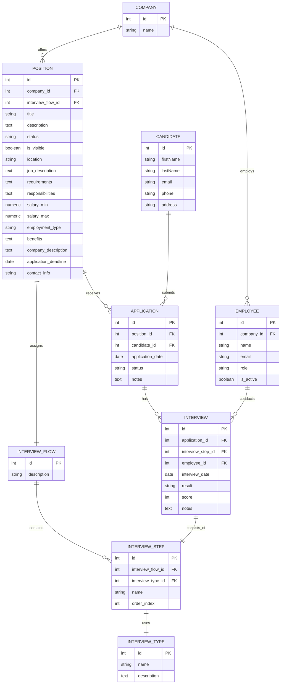
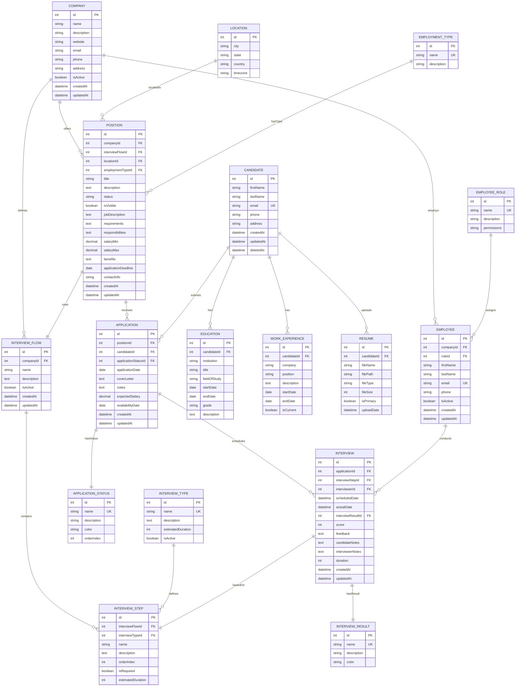

# Prompts utilizados para este ejercicio

**Este ejercicio fue resuelto con Visual Studio Code con GitHub Copilot y Claude Sonnet 4**

## Prompt 1
@workspace Act as a senior backend engineer specialized in Prisma and PostgreSQL.
Analyze all the files where models, entities, or database configurations are defined (backend/, backend/prisma/schema.prisma, backend/prisma/migrations/) and explain the following:

What tables exist.
How they are related to each other.
Are there any inconsistencies or do you have any suggestions about how to optimize the database following good practices?

## Prompt 2
Ok this is great answer, but I want to update the database in another way. I have to add new entities to the database. To do so I have an ERD in mermaid with the new entities and their relations. Take into account that this ERD is not normalized or indexed and I want you @workspace to update the Prisma schema in this way:
1. Analyze the mermaid script I’ll provide.
2. How the new entities will relate to the existing ones?
3. Given there is no normalization just yet you can suggest new entities if that will make the new database schema more optimized.
4. Create indexes where necessary.
5. Look for inconsistencies and correct them.
6. Transform all of this steps and suggestions into a new prisma schema.

Do not create any code just yet, just show me step by step how you would change the existing database with the mermaid script I’ll provide and how the new schema would look.
But I would like you to make a new mermaid script with the new database proposal so I can analyze better the new entities and their relations.
Here’s the mermaid script with the new entities to include in the database:

## Prompt 3

This new schema proposal is excellent. What are the next steps to implement the new updated database?

**NOTA: Adjunto aqui el script en mermaid que le pedí al LLM que creara. Un nuevo ERD de la nueva base de datos.**

## Prompt 4 (troubleshooting)

I got this error when running: npx prisma migrate reset:
✔ Are you sure you want to reset your database? All data will be lost. … yes

Applying migration 20251115173741_db_avc
Error: P3018

A migration failed to apply. New migrations cannot be applied before the error is recovered from. Read more about how to resolve migration issues in a production database: https://pris.ly/d/migrate-resolve

Migration name: 20251115173741_db_avc

Database error code: 42P01

Database error:
ERROR: relation "Education" does not exist

DbError { severity: "ERROR", parsed_severity: Some(Error), code: SqlState(E42P01), message: "relation "Education" does not exist", detail: None, hint: None, position: None, where_: None, schema: None, table: None, column: None, datatype: None, constraint: None, file: Some("namespace.c"), line: Some(636), routine: Some("RangeVarGetRelidExtended") }

